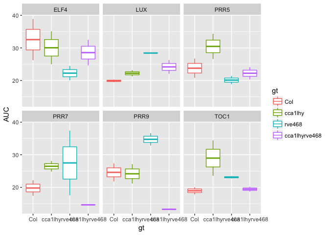

# area-under_curve
Stacey Harmer  
7/20/2017  


My goal is to automate a previously created function so that I can easily determine qPCR area-under-curve for individual genes and across unique time frames (time frames unique to each genotype and represent one circadian day).


```r
library(tidyverse)
```

```
## Loading tidyverse: ggplot2
## Loading tidyverse: tibble
## Loading tidyverse: tidyr
## Loading tidyverse: readr
## Loading tidyverse: purrr
## Loading tidyverse: dplyr
```

```
## Conflicts with tidy packages ----------------------------------------------
```

```
## filter(): dplyr, stats
## lag():    dplyr, stats
```

```r
library(MESS)
```

```
## Loading required package: geepack
```

```
## Loading required package: geeM
```

```
## Loading required package: Matrix
```

```
## 
## Attaching package: 'Matrix'
```

```
## The following object is masked from 'package:tidyr':
## 
##     expand
```

Below is the original code:


```r
Akiva.12deg<- read_csv("qRT-PCR_data_12c_6genes_n.csv") #read it in as a tibble
```

```
## Parsed with column specification:
## cols(
##   time = col_integer(),
##   expn = col_double(),
##   gene = col_character(),
##   gt = col_character(),
##   light = col_character(),
##   rep = col_character()
## )
```

```r
head(Akiva.12deg)
```

```
## # A tibble: 6 × 6
##    time      expn  gene    gt light   rep
##   <int>     <dbl> <chr> <chr> <chr> <chr>
## 1    24 0.7444322   LUX   Col    LL  rep1
## 2    27 0.3420660   LUX   Col    LL  rep1
## 3    30 0.7249853   LUX   Col    LL  rep1
## 4    33 1.5997045   LUX   Col    LL  rep1
## 5    36 1.2732694   LUX   Col    LL  rep1
## 6    39 0.8051121   LUX   Col    LL  rep1
```

```r
tail(Akiva.12deg)
```

```
## # A tibble: 6 × 6
##    time      expn  gene      gt light   rep
##   <int>     <dbl> <chr>   <chr> <chr> <chr>
## 1    42 0.9244249  PRR9 cca1lhy    LL  rep2
## 2    45 1.1748752  PRR9 cca1lhy    LL  rep2
## 3    48 0.9544120  PRR9 cca1lhy    LL  rep2
## 4    51 0.6510480  PRR9 cca1lhy    LL  rep2
## 5    54 0.5624138  PRR9 cca1lhy    LL  rep2
## 6    57 0.4736999  PRR9 cca1lhy    LL  rep2
```

Make the data wide

```r
PCR.12.wide <- spread(Akiva.12deg,key = gene, value = expn ) %>%
  mutate(gt.rep = paste(gt, rep, sep = "."))
head(PCR.12.wide)
```

```
## # A tibble: 6 × 11
##    time            gt light   rep      ELF4       LUX      PRR5       PRR7
##   <int>         <chr> <chr> <chr>     <dbl>     <dbl>     <dbl>      <dbl>
## 1    24       cca1lhy    LL  rep1 0.7614978 1.0159563 0.8754983 1.08389818
## 2    24       cca1lhy    LL  rep2 0.5325001 0.8054884 0.5434463 0.62551410
## 3    24 cca1lhyrve468    LL  rep1 0.6674427 0.8242006 0.4024810 0.06825593
## 4    24 cca1lhyrve468    LL  rep2 0.7459150 0.6513596 0.5311108 0.09719690
## 5    24           Col    LL  rep1 0.4225847 0.7444322 0.1598923 0.06971710
## 6    24           Col    LL  rep2 0.3057271 0.4399131 0.1450424 0.10571808
## # ... with 3 more variables: PRR9 <dbl>, TOC1 <dbl>, gt.rep <chr>
```

Original code:


```r
PRR5_12deg_24_48.6 <- sapply(unique(PCR.12.wide$gt.rep), function(gt.rep) {
  tmp <- PCR.12.wide[PCR.12.wide$gt.rep==gt.rep,]
  auc(tmp$time,tmp$PRR5,type="spline", from =24, to = 48.6)
})
PRR5_12deg_24_48.6
```

```
##       cca1lhy.rep1       cca1lhy.rep2 cca1lhyrve468.rep1 
##           41.80379           32.55078           19.65421 
## cca1lhyrve468.rep2           Col.rep1           Col.rep2 
##           23.24228           20.81449           26.72926 
##        rve468.rep1        rve468.rep2 
##           16.23943           18.51161
```

I want to be able to step through each of the genes.  would it be better if I used long insetad of wide dataframe?


```r
Akiva.12deg <- Akiva.12deg %>%
  mutate(gt.rep = paste(gt, rep, sep = "."))

head(Akiva.12deg)
```

```
## # A tibble: 6 × 7
##    time      expn  gene    gt light   rep   gt.rep
##   <int>     <dbl> <chr> <chr> <chr> <chr>    <chr>
## 1    24 0.7444322   LUX   Col    LL  rep1 Col.rep1
## 2    27 0.3420660   LUX   Col    LL  rep1 Col.rep1
## 3    30 0.7249853   LUX   Col    LL  rep1 Col.rep1
## 4    33 1.5997045   LUX   Col    LL  rep1 Col.rep1
## 5    36 1.2732694   LUX   Col    LL  rep1 Col.rep1
## 6    39 0.8051121   LUX   Col    LL  rep1 Col.rep1
```

```r
#all_12deg_24_48.6 <- sapply(unique(Akiva.12deg$gt.rep), function(gt.rep) {
#  gene <- Akiva.12deg[Akiva.12deg$gene==gene,],
#  tmp <- Akiva.12deg[Akiva.12deg$gt.rep==gt.rep,]
#  auc(tmp$time,tmp$gene,type="spline", from =24, to = 48.6)
#})
```
that failed. 


```r
head(PCR.12.wide)
```

```
## # A tibble: 6 × 11
##    time            gt light   rep      ELF4       LUX      PRR5       PRR7
##   <int>         <chr> <chr> <chr>     <dbl>     <dbl>     <dbl>      <dbl>
## 1    24       cca1lhy    LL  rep1 0.7614978 1.0159563 0.8754983 1.08389818
## 2    24       cca1lhy    LL  rep2 0.5325001 0.8054884 0.5434463 0.62551410
## 3    24 cca1lhyrve468    LL  rep1 0.6674427 0.8242006 0.4024810 0.06825593
## 4    24 cca1lhyrve468    LL  rep2 0.7459150 0.6513596 0.5311108 0.09719690
## 5    24           Col    LL  rep1 0.4225847 0.7444322 0.1598923 0.06971710
## 6    24           Col    LL  rep2 0.3057271 0.4399131 0.1450424 0.10571808
## # ... with 3 more variables: PRR9 <dbl>, TOC1 <dbl>, gt.rep <chr>
```

I suspect I need to incoroprate something like the below

 for(i in 5:10)
    { 
      PCR.12.wide[, i];
    }
but I can't figure it out

Yes, that would be one way to do it, but I wonder if we could use summarize instead


```r
results <- Akiva.12deg %>%
  group_by(gene,gt,rep) %>%
  summarize(auc=auc(time,expn,type="spline", from =24, to = 48.6))
```

let's compare the prr5 results from this method and the Stacey's single call

```r
results %>% filter(gene=="PRR5")
```

```
## Source: local data frame [8 x 4]
## Groups: gene, gt [4]
## 
##    gene            gt   rep      auc
##   <chr>         <chr> <chr>    <dbl>
## 1  PRR5       cca1lhy  rep1 41.80379
## 2  PRR5       cca1lhy  rep2 32.55078
## 3  PRR5 cca1lhyrve468  rep1 19.65421
## 4  PRR5 cca1lhyrve468  rep2 23.24228
## 5  PRR5           Col  rep1 20.81449
## 6  PRR5           Col  rep2 26.72926
## 7  PRR5        rve468  rep1 16.23943
## 8  PRR5        rve468  rep2 18.51161
```


```r
PRR5_12deg_24_48.6
```

```
##       cca1lhy.rep1       cca1lhy.rep2 cca1lhyrve468.rep1 
##           41.80379           32.55078           19.65421 
## cca1lhyrve468.rep2           Col.rep1           Col.rep2 
##           23.24228           20.81449           26.72926 
##        rve468.rep1        rve468.rep2 
##           16.23943           18.51161
```

Success!

### can we use lmer as function within summarize?

I will calculate the AUC for one circadian day for the differnet genotypes

### Col 

```r
library(MESS)

auc_Col <- Akiva.12deg %>%
  group_by(gene, rep, gt) %>%
  summarize(auc = auc(time, expn, type="spline", from =24, to = 48.6)) %>%
  filter(gt == "Col") %>%
  mutate(gt.biorep = paste(gt, rep, sep="."))

auc_Col
```

```
## Source: local data frame [12 x 5]
## Groups: gene, rep [12]
## 
##     gene   rep    gt      auc gt.biorep
##    <chr> <chr> <chr>    <dbl>     <chr>
## 1   ELF4  rep1   Col 26.21715  Col.rep1
## 2   ELF4  rep2   Col 38.85823  Col.rep2
## 3    LUX  rep1   Col 20.31007  Col.rep1
## 4    LUX  rep2   Col 19.47661  Col.rep2
## 5   PRR5  rep1   Col 20.81449  Col.rep1
## 6   PRR5  rep2   Col 26.72926  Col.rep2
## 7   PRR7  rep1   Col 17.42361  Col.rep1
## 8   PRR7  rep2   Col 22.17927  Col.rep2
## 9   PRR9  rep1   Col 27.37001  Col.rep1
## 10  PRR9  rep2   Col 21.84398  Col.rep2
## 11  TOC1  rep1   Col 17.83367  Col.rep1
## 12  TOC1  rep2   Col 20.05880  Col.rep2
```

```r
# and now spread so it's wide 

auc_Col <- spread(auc_Col, key = gene, value = auc )
```

### cca1 lhy
ccalhy: 21.5 hr   (24 to 45.5)

```r
auc_cca1lhy <- Akiva.12deg %>%
  group_by(gene, rep, gt) %>%
  summarize(auc = auc(time, expn, type="spline", from =24, to = 45.5)) %>%
  filter(gt == "cca1lhy") %>%
  mutate(gt.biorep = paste(gt, rep, sep="."))

auc_cca1lhy
```

```
## Source: local data frame [12 x 5]
## Groups: gene, rep [12]
## 
##     gene   rep      gt      auc    gt.biorep
##    <chr> <chr>   <chr>    <dbl>        <chr>
## 1   ELF4  rep1 cca1lhy 35.10785 cca1lhy.rep1
## 2   ELF4  rep2 cca1lhy 24.97199 cca1lhy.rep2
## 3    LUX  rep1 cca1lhy 23.16489 cca1lhy.rep1
## 4    LUX  rep2 cca1lhy 21.28055 cca1lhy.rep2
## 5   PRR5  rep1 cca1lhy 34.31808 cca1lhy.rep1
## 6   PRR5  rep2 cca1lhy 26.60158 cca1lhy.rep2
## 7   PRR7  rep1 cca1lhy 28.08292 cca1lhy.rep1
## 8   PRR7  rep2 cca1lhy 24.84967 cca1lhy.rep2
## 9   PRR9  rep1 cca1lhy 27.14094 cca1lhy.rep1
## 10  PRR9  rep2 cca1lhy 21.18597 cca1lhy.rep2
## 11  TOC1  rep1 cca1lhy 34.40744 cca1lhy.rep1
## 12  TOC1  rep2 cca1lhy 23.54725 cca1lhy.rep2
```

```r
# and now spread so it's wide 

auc_cca1lhy <- spread(auc_cca1lhy, key = gene, value = auc )
```

### rve468
rve468: 29.24     (24 to 53.2)

```r
auc_rve468 <- Akiva.12deg %>%
  group_by(gene, rep, gt) %>%
  summarize(auc = auc(time, expn, type="spline", from =24, to = 53.2)) %>%
  filter(gt == "rve468") %>%
  mutate(gt.biorep = paste(gt, rep, sep="."))

auc_rve468
```

```
## Source: local data frame [12 x 5]
## Groups: gene, rep [12]
## 
##     gene   rep     gt      auc   gt.biorep
##    <chr> <chr>  <chr>    <dbl>       <chr>
## 1   ELF4  rep1 rve468 24.45670 rve468.rep1
## 2   ELF4  rep2 rve468 20.05929 rve468.rep2
## 3    LUX  rep1 rve468 28.34368 rve468.rep1
## 4    LUX  rep2 rve468 28.50661 rve468.rep2
## 5   PRR5  rep1 rve468 18.86255 rve468.rep1
## 6   PRR5  rep2 rve468 21.37495 rve468.rep2
## 7   PRR7  rep1 rve468 17.57962 rve468.rep1
## 8   PRR7  rep2 rve468 37.40510 rve468.rep2
## 9   PRR9  rep1 rve468 32.81475 rve468.rep1
## 10  PRR9  rep2 rve468 36.64968 rve468.rep2
## 11  TOC1  rep1 rve468 23.44447 rve468.rep1
## 12  TOC1  rep2 rve468 22.74911 rve468.rep2
```

```r
# and now spread so it's wide 

auc_rve468 <- spread(auc_rve468, key = gene, value = auc )
```

### quint
quint: 25.5      (24 to 49.5)

```r
auc_quint <- Akiva.12deg %>%
  group_by(gene, rep, gt) %>%
  summarize(auc = auc(time, expn, type="spline", from =24, to = 49.5)) %>%
  filter(gt == "cca1lhyrve468") %>%
  mutate(gt.biorep = paste(gt, rep, sep="."))

auc_quint
```

```
## Source: local data frame [12 x 5]
## Groups: gene, rep [12]
## 
##     gene   rep            gt      auc          gt.biorep
##    <chr> <chr>         <chr>    <dbl>              <chr>
## 1   ELF4  rep1 cca1lhyrve468 24.62996 cca1lhyrve468.rep1
## 2   ELF4  rep2 cca1lhyrve468 32.47661 cca1lhyrve468.rep2
## 3    LUX  rep1 cca1lhyrve468 26.29133 cca1lhyrve468.rep1
## 4    LUX  rep2 cca1lhyrve468 22.05251 cca1lhyrve468.rep2
## 5   PRR5  rep1 cca1lhyrve468 20.34345 cca1lhyrve468.rep1
## 6   PRR5  rep2 cca1lhyrve468 24.09979 cca1lhyrve468.rep2
## 7   PRR7  rep1 cca1lhyrve468 14.71649 cca1lhyrve468.rep1
## 8   PRR7  rep2 cca1lhyrve468 14.56617 cca1lhyrve468.rep2
## 9   PRR9  rep1 cca1lhyrve468 13.35292 cca1lhyrve468.rep1
## 10  PRR9  rep2 cca1lhyrve468 13.19470 cca1lhyrve468.rep2
## 11  TOC1  rep1 cca1lhyrve468 20.19173 cca1lhyrve468.rep1
## 12  TOC1  rep2 cca1lhyrve468 18.71159 cca1lhyrve468.rep2
```

```r
# and now spread so it's wide 

auc_quint <- spread(auc_quint, key = gene, value = auc )
```

Great, now join them together.  


```r
auc_all <- bind_rows(auc_Col, auc_cca1lhy, auc_rve468, auc_quint)
auc_all
```

```
## Source: local data frame [8 x 9]
## Groups: rep [2]
## 
##     rep            gt          gt.biorep     ELF4      LUX     PRR5
##   <chr>         <chr>              <chr>    <dbl>    <dbl>    <dbl>
## 1  rep1           Col           Col.rep1 26.21715 20.31007 20.81449
## 2  rep2           Col           Col.rep2 38.85823 19.47661 26.72926
## 3  rep1       cca1lhy       cca1lhy.rep1 35.10785 23.16489 34.31808
## 4  rep2       cca1lhy       cca1lhy.rep2 24.97199 21.28055 26.60158
## 5  rep1        rve468        rve468.rep1 24.45670 28.34368 18.86255
## 6  rep2        rve468        rve468.rep2 20.05929 28.50661 21.37495
## 7  rep1 cca1lhyrve468 cca1lhyrve468.rep1 24.62996 26.29133 20.34345
## 8  rep2 cca1lhyrve468 cca1lhyrve468.rep2 32.47661 22.05251 24.09979
## # ... with 3 more variables: PRR7 <dbl>, PRR9 <dbl>, TOC1 <dbl>
```

Now gather for easy ggplotting

```r
auc_all_gather <- auc_all %>%
  gather(key = "gene", value ="AUC", 4:9)
```

Now I can easily plot them all using facet


```r
# first, order genotypes appropriately
gt_order <- c("Col", "cca1lhy", "rve468", "cca1lhyrve468")

auc_all_gather <- auc_all_gather %>%
  mutate(gt = factor(gt, levels = gt_order)) %>%
  arrange(gt)

# now plot
auc_all_gather %>%
  group_by(gt) %>%
  ggplot(aes(color = gt)) +
  geom_boxplot(aes(x = gt, y=AUC)) + 
  facet_wrap(~gene)
```

<!-- -->

Can I use lmer wiht summrize?


```r
library(lme4)
library(lmerTest)
```

```
## 
## Attaching package: 'lmerTest'
```

```
## The following object is masked from 'package:lme4':
## 
##     lmer
```

```
## The following object is masked from 'package:stats':
## 
##     step
```

```r
head(auc_all_gather)
```

```
## Source: local data frame [6 x 5]
## Groups: rep [2]
## 
##     rep     gt gt.biorep  gene      AUC
##   <chr> <fctr>     <chr> <chr>    <dbl>
## 1  rep1    Col  Col.rep1  ELF4 26.21715
## 2  rep2    Col  Col.rep2  ELF4 38.85823
## 3  rep1    Col  Col.rep1   LUX 20.31007
## 4  rep2    Col  Col.rep2   LUX 19.47661
## 5  rep1    Col  Col.rep1  PRR5 20.81449
## 6  rep2    Col  Col.rep2  PRR5 26.72926
```

My attempt:


```r
#lmer_12deg <-  auc_all_gather %>%
#  group_by(gene, gt) %>%
#  summarize(lmer = lmer(AUC ~ gt + (1|rep))) 
```

failed.
